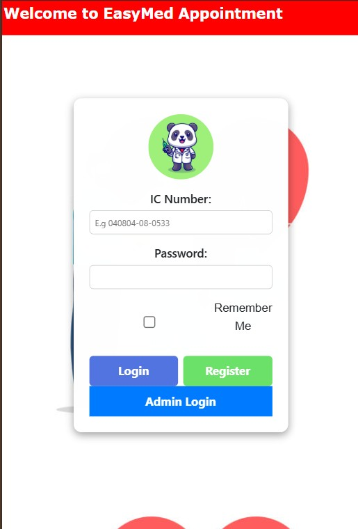
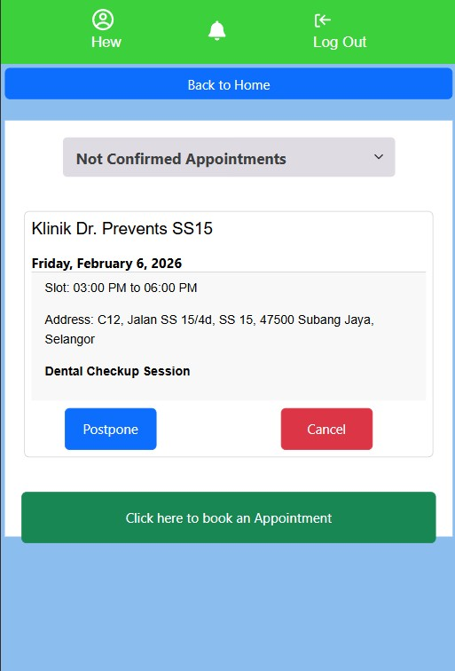
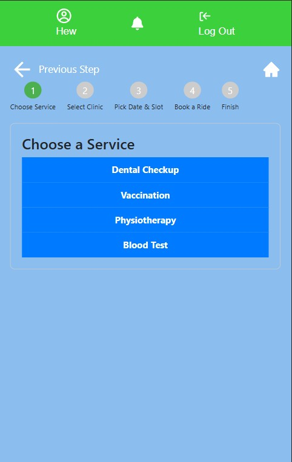
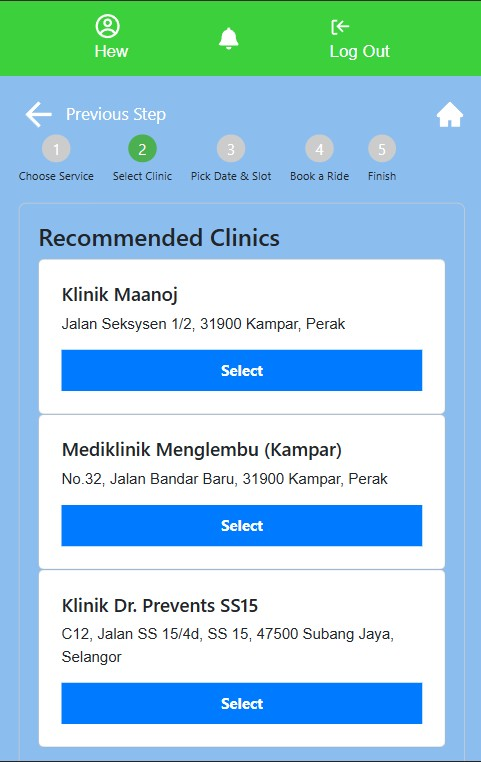
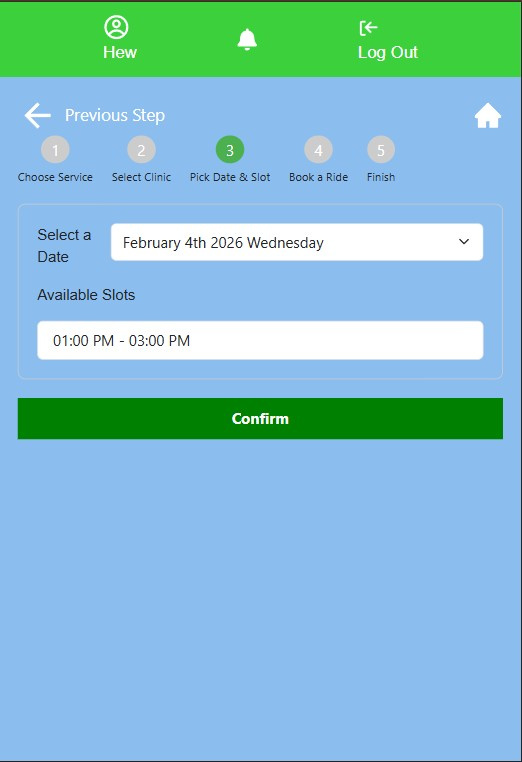
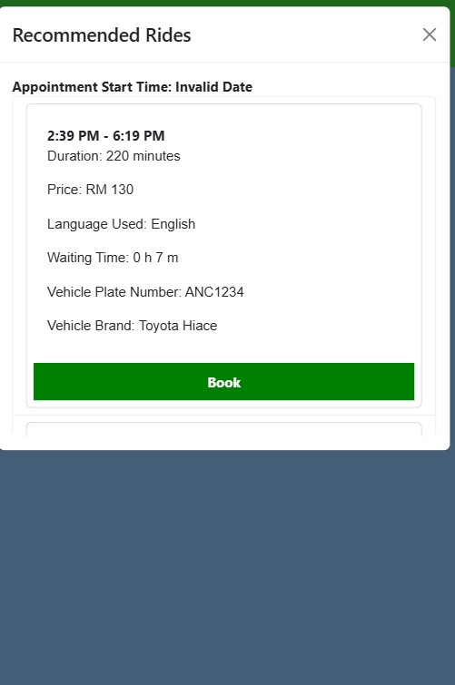

# Background of the Project

Medical Visitation Accompaniment (**MVA**) services are increasingly in demand in Malaysia as elderlies seek support for mobility and healthcare. Due to frailty, many elderly individuals find it difficult to attend clinic appointments independently, often requiring specialized equipment such as wheelchairs. MVAs provide the necessary facilities to ensure comfort and convenience during travel.

However, the term **Medical Visitation Accompaniment** is not well-known among elderly people. This project aims to bridge clinic appointment booking systems with MVA services, making these services more accessible and easier to use for the elderly population.

---

# Problem Statement

Current clinic systems in Malaysia face several issues:

- **Cumbersome appointment procedures**: Elderly patients often find it tedious to call clinics for booking appointments.
- **Manual record-keeping**: Many clinics still use pen-and-paper systems, which are prone to errors and mismanagement.
- **Long waiting times**: Patients, including elderlies, may wait up to two hours for their appointments, causing frustration and potentially discouraging future visits.
- **Complex digital systems**: Modern health applications are often overloaded with information and too many buttons, causing cognitive overload for elderly users.

As a result, elderly patients prioritize straightforward, simple procedures for booking appointments. Current systems fail to meet this requirement.

---

## Proposed Solution

This project addresses these challenges by:

- Digitally recording clinic appointments in a structured database to ensure consistency and reliability.
- Allowing clinics to define available time slots, reducing patient waiting times.
- Simplifying the booking interface for elderly users to just **three steps**, plus an optional step for booking an MVA ride:

### Booking Process

1. Select an appointment type (e.g., follow-up, dental checkup)
2. Select a nearby clinic
3. Choose an available slot
4. Book suggested MVA rides (optional)

Currently, MVA services in Malaysia are mostly accessible through certain websites, which are not well-known or easy to find for elderly users. This project provides direct access to MVA services, easing mobility to nearby clinics and promoting wider adoption of these services.

A **web-based platform** was chosen to avoid Google Play intervention or app updates, allowing elderly users to access the system without additional technical hurdles.

---

# Technical Description

The project uses a **three-tier architecture** combined with **microservices**, with the following tech stack:

## Tech Stack

- **Frontend**: React, Redux
- **Backend**: Express.js, FastAPI
- **Machine Learning**: Python, scikit-learn

---

# Core Feature: ML-Powered Ranking System

The main selling point is the **Decision Tree Regression-based ranking system** for MVA schedules. It considers multiple factors when recommending rides:

- Time availability of ride facilitators
- Buffer time needed for elderlies to prepare for the journey
- Estimated travel distance and duration to the clinic
- Availability of a wheelchair
- Language spoken by facilitators/staff
- Waiting time before the appointment

Based on these inputs, the system calculates a **fitness score** for each eligible MVA schedule. A higher fitness score indicates a better match. The **Decision Tree Regressor** predicts the fitness score using numerical data.

---

# Why a Decision Tree?

- **Fast inference**: Quickly ranks multiple potential schedules in real-time.
- **Interpretability**: Provides clear reasoning behind recommendations, important for healthcare applications.
- **Non-linear relationships**: Handles conditional scheduling logic (e.g., factoring in wheelchair availability, buffer time) effectively.

Optimizing the Decision Tree ensures predictions are performed in the shortest possible time, allowing real-time recommendation and seamless scheduling for elderly users.

# Sample Screenshot 

   

    

    

    

            

 

